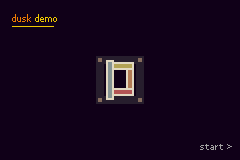
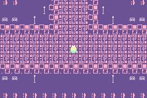

# dusk

**dusk**, a library for gba dev

supported toolchains:
- DevkitARM/C/C++ (version 0.1.x), [view](https://github.com/redthing1/dusk/tree/lang_c)
- DevkitARM/D (version 0.2+) [view](https://github.com/redthing1/dusk/tree/d-port)

## media!




## features
+ simple, intuitive C/D API
+ library integration
    + built in support for TONC, GBFS
+ graphics
    + scene architecture
    + 8bpp texture atlas packing
    + sprite/animation helpers
    + tiled map exporter and loader
+ (WIP) saves

## ideas

dusk is built all around the idea of simplicity, clarity, and readability.
the exposed api is minimal, but not limiting.

## samples

sample projects can be found here: https://github.com/redthing1/dusk/tree/main/demo

these demo projects are written simply and cleanly.

they have plenty of comments explaining what and why the code does what it does.

furthermore, they demonstrate many of the different features provided by dusk.

## documentation

in the spirit of simplicity and minimalism, and to back up the claims that dusk is simple and easy:

documentation is provided in the literate style, interspersed within a few header files.
these header files contain the entirety of the dusk core api.

view these self documenting files here: https://github.com/redthing1/dusk/tree/main/src/dusk/include

## hacking

### requirements
+ devkitARM's `gba-dev` ([setup](https://devkitpro.org/wiki/Getting_Started))
+ [Tiled2GBA](https://github.com/LucvandenBrand/Tiled2GBA/tree/master/converter) converter in path as `Tiled2GBA`
+ [crunch](https://github.com/xdrie/crunch) atlas packer in path as `crunch_gen`

### build

enter `demo/DuskDemo` and run:

```sh
make
```

this will output `DuskDemo.gba`, which can be loaded up in your favorite GBA emulator.
