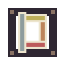

# dusk

DUsK, a library for gba dev

## features
+ library integration
    + built in support for TONC, GBFS
+ graphics
    + scene architecture
    + 8bpp texture atlas packing
    + sprite/animation helpers
    + tiled map exporter and loader (via Tiled2GBA)
+ (WIP) saves

## hacking

### requirements
+ devkitARM's `gba-dev` ([setup](https://devkitpro.org/wiki/Getting_Started))
+ [Tiled2GBA](https://github.com/LucvandenBrand/Tiled2GBA/tree/master/converter) converter in path as `Tiled2GBA`
+ [crunch](https://github.com/xdrie/crunch) atlas packer in path as `crunch_gen`

### build

enter `demo` and run:

```sh
make
```

this will output `DuskDemo.gba`, which can be loaded up in your favorite GBA emulator.
