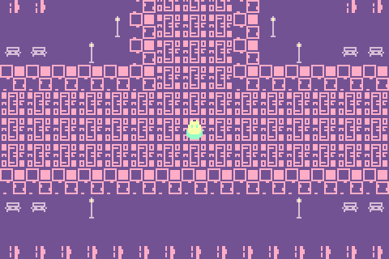

# Fountain_GBA

A simple demo of a fountain scene as a GBA rom.

## screenshot



## hacking

### requirements
- devkitARM's `gba-dev` ([setup](https://devkitpro.org/wiki/Getting_Started))
- [Tiled2GBA](https://github.com/LucvandenBrand/Tiled2GBA/tree/master/converter) converter in path as `Tiled2GBA`

### build

simply run:

```sh
make
```

this will output `Fountain.gba`, which can be loaded up in your favorite GBA emulator.
